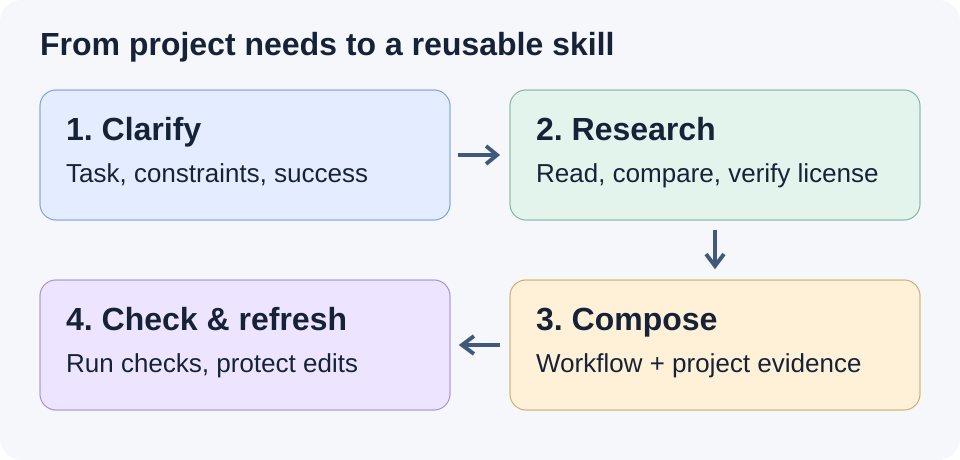

# Project Skill Builder

[简体中文](README_ZH.md) · [Usage](docs/usage.md) · [Validation](docs/validation.md)

A Codex skill that clarifies a project's recurring task, researches public skills, compares their fit, and creates a self-contained skill for that project.



The agent interviews and researches; small Python scripts validate bundles, hash selected project files, and protect manual edits during refresh. This is an exploratory tool for software projects. It requires Codex, Python 3.9+, and a browsing or repository tool for public research. It does not include a hosted catalog or search API.

## Install

Download or clone this repository. From its root, install into an **existing project**:

```sh
python tools/install.py --project "path/to/your-project"
```

The installer creates `.agents/skills/project-skill-builder/` in that project and refuses to overwrite an existing installation. Alternatively, copy `skills/project-skill-builder/` there yourself. Reopen the project in Codex if it does not appear immediately.

## Use

Explicitly invoke the skill in Codex:

```text
$project-skill-builder
Build a project skill for our recurring CSV maintenance tasks.
Read the README and tests, clarify any missing policy, research relevant
public skills, compare their tradeoffs, and create a self-contained bundle.
```

It considers at most 10 initial candidates and deeply reads 3–5 when enough fit. It may select one, several, or none. Project constraints determine the decision. Copied or adapted resources need verified permission and attribution.

The result includes a coherent SKILL.md, project constraints, candidate decisions, source/version/license records, acceptance cases, hashes and a separate user-overrides file. Install that generated bundle into your project's `.agents/skills/<bundle-name>/` when ready to use it.

For refresh, explicitly ask to update the existing bundle. The agent generates a proposal separately, previews changes, and applies an authorized update. Conflicting manual edits stop replacement; user overrides and user-added files are preserved. [Commands and file contract →](docs/usage.md)

## Verify

```sh
python -m unittest discover -s tests -v
python skills/project-skill-builder/scripts/validate_bundle.py validate skills/project-skill-builder --skill-only
```

The examples and local candidates are synthetic. `examples/csv-tool` intentionally starts with incomplete input validation so behavior checks can expose failures. Its nominal tests pass, while `python evals/grade_csv.py examples/csv-tool` is expected to report failures. See the [executed validation report](docs/validation.md) for test results, public source checks and the small behavior comparison.

Static checks verify structure and recorded evidence, not the truth of a remote license or whether a task actually ran. The agent must record unavailable research and unexecuted behavior honestly. A small comparison cannot establish general performance gains.

## License

[MIT](LICENSE), © 2026 [cloudwallker](https://github.com/cloudwallker). External candidates retain their own licenses; this repository's license does not relicense them.
