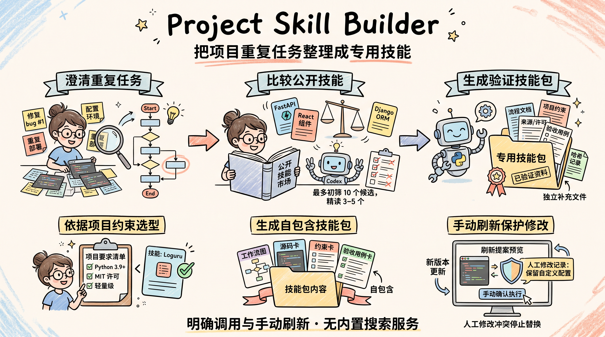

# Project Skill Builder

[English](README.md) · [使用说明](docs/usage.md) · [验证记录](docs/validation.md)

一个用于 Codex 的元 skill：先界定项目中的反复任务，再研究公开 skills、比较适配程度，最后生成自包含的项目专用 skill。


Codex 负责沟通、检索与整合；Python 脚本负责包校验、项目文件快照和刷新时保护人工修改。这是面向软件项目的探索性工具，需要 Codex、Python 3.9+，以及用于公开检索的浏览或仓库工具；项目自身不提供搜索服务。



## 安装

下载或克隆本仓库，在仓库根目录执行，目标须为**已经存在的项目目录**：

```sh
python tools/install.py --project "你的项目路径"
```

安装器写入该项目的 `.agents/skills/project-skill-builder/`，遇到已有安装会停止。也可以手动复制 `skills/project-skill-builder/` 到同一位置。如果 Codex 没有立即显示，请重新打开项目。

## 使用

在 Codex 中显式调用：

```text
$project-skill-builder
为这个项目反复维护 CSV 汇总的任务创建一个 skill。
读取 README 和测试，澄清关键缺项，研究相关公开 skills，
比较优劣，再生成包含项目约束、来源和验收用例的自包含包。
```

最多初筛 10 个候选；有足够适配候选时精读 3–5 个。可以采用一个、多个或零个，项目约束决定取舍。复制或改写外部内容前，需要核实许可并保留必要署名。

生成包包含统一流程、项目约束、候选决策、来源/版本/许可、验收用例、受管文件哈希和独立的人工补充文件。把生成包安装到项目的 `.agents/skills/<包名>/` 后即可使用。

刷新需要手动发起。Codex 会另建提案，先预览，再执行已授权更新。人工修改发生冲突时停止替换，保留人工补充和新增文件。[脚本命令与包结构 →](docs/usage.md)

## 验证

```sh
python -m unittest discover -s tests -v
python skills/project-skill-builder/scripts/validate_bundle.py validate skills/project-skill-builder --skill-only
```

示例项目和本地候选均为合成数据。`examples/csv-tool` 故意保留不完整的输入校验，基础测试通过，而 `python evals/grade_csv.py examples/csv-tool` 预期报告部分失败。实际脚本测试、公开来源核对和小规模行为对照见[验证记录](docs/validation.md)。

静态校验检查结构与证据格式，不能证明远程许可真实或任务实际执行。工具不可用、尚未检索和未执行的行为必须如实记录。当前对照不能证明普遍效果提升。

## 许可证

[MIT](LICENSE)，© 2026 [cloudwallker](https://github.com/cloudwallker)。外部候选保留各自许可证，本仓库的许可不改变外部内容的授权。
